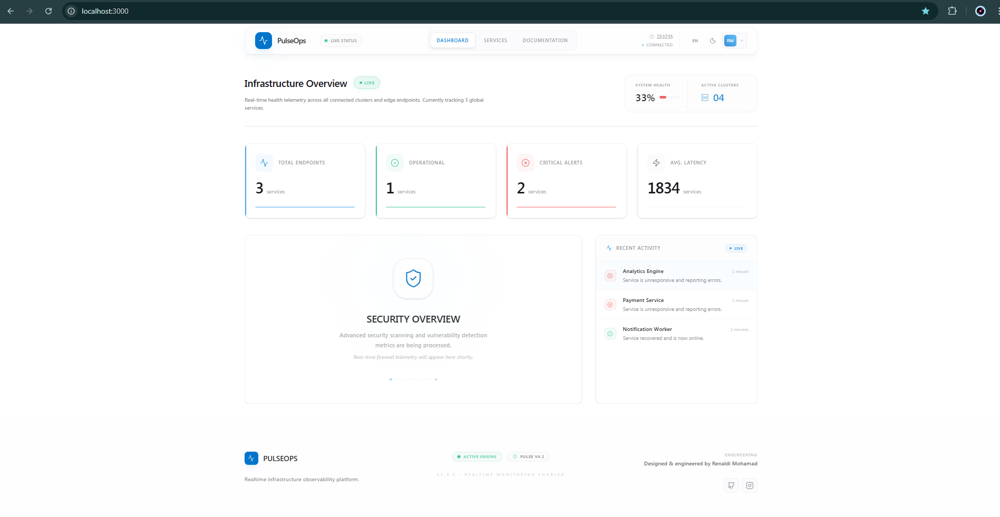
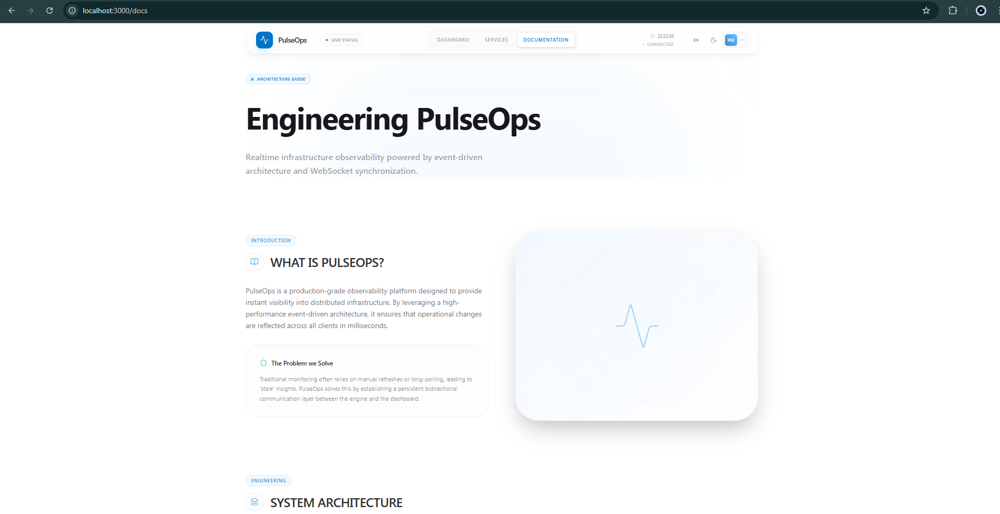
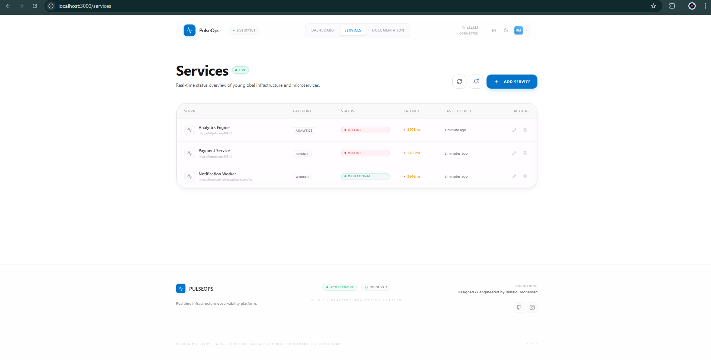
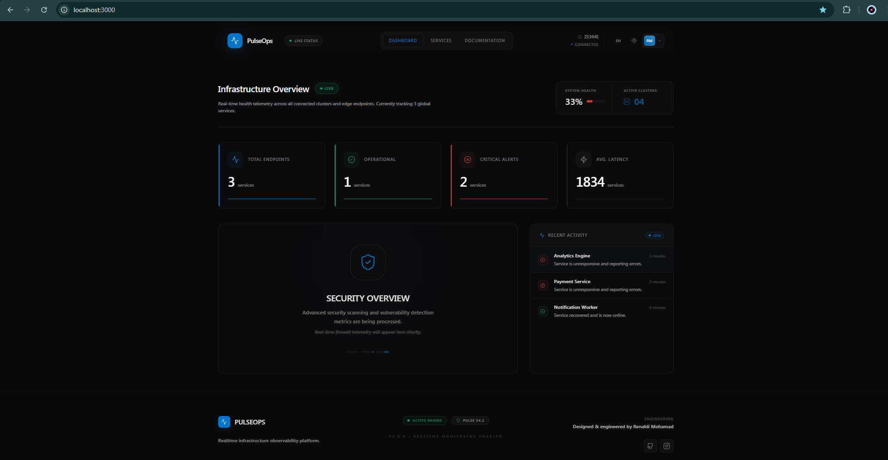
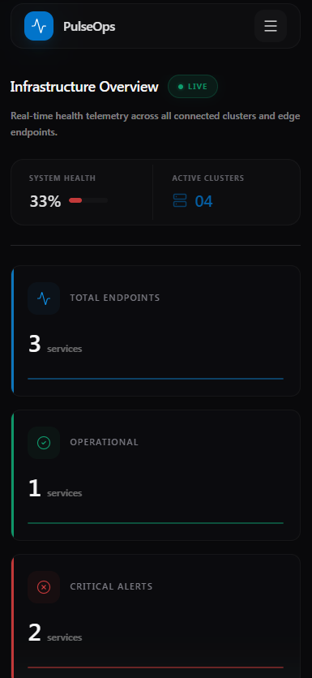
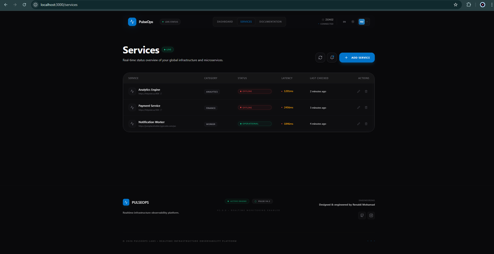

# 📡 PulseOps — Realtime Infrastructure Observability

[](https://nextjs.org/)
[](https://nestjs.org/)
[](https://www.prisma.io/)
[](https://socket.io/)
[](https://www.postgresql.org/)

**PulseOps** adalah platform *realtime observability dashboard* dan *centralized monitoring command center* kelas enterprise yang dirancang untuk memberikan visibilitas instan terhadap kesehatan infrastruktur kritis Anda.

> **Designed & Engineered by Renaldi Mohamad**

---

## 🖼️ Preview

| Dashboard Overview | Documentation Page |
| :--- | :--- |
|  |  |

| Services Management | Dark & Light Mode |
| :--- | :--- |
|  |  |

| Mobile Responsive | Realtime Engine Sync |
| :--- | :--- |
|  |  |

---

## 🎯 Fokus Platform

Dalam ekosistem modern yang kompleks, ketersediaan layanan adalah segalanya. **PulseOps** memberikan pendekatan pemantauan proaktif melalui telemetri kesehatan layanan yang dipusatkan ke dalam satu panel kontrol yang sinkron secara *realtime*.

Platform ini memungkinkan tim rekayasa untuk mendeteksi degradasi performa sebelum menjadi pemadaman sistem yang berdampak pada bisnis, memastikan SLA tetap terjaga dan kepercayaan pengguna tetap tinggi.

---

## ✨ Fitur Utama

-   🔄 **Realtime WebSocket Synchronization**: Sinkronisasi status instan di semua perangkat tanpa perlu memuat ulang halaman.
-   📊 **Enterprise Observability**: Visualisasi metrik kesehatan infrastruktur yang granular dan intuitif.
-   🩺 **Autonomous Probing Engine**: Mesin pemantau cerdas yang bekerja secara mandiri di latar belakang.
-   🌓 **Premium UI Experience**: Estetika SaaS modern dengan dukungan penuh Dark/Light mode.
-   🌐 **Bilingual Support**: Mendukung Bahasa Indonesia & English secara dinamis untuk tim global.
-   📱 **Fully Responsive**: Pengalaman kontrol penuh baik di pusat operasi (NOC) maupun perangkat mobile.
-   🚀 **Event-Driven Architecture**: Dibangun di atas fondasi yang skalabel dan resilien terhadap beban tinggi.
-   📜 **Live System Activity**: Log peristiwa sistem yang disiarkan langsung untuk audit operasional.
-   ⚡ **High-Precision Latency Tracking**: Pengukuran responsivitas layanan dengan tingkat akurasi tinggi.

---

## 🏗️ Arsitektur Sistem

PulseOps dirancang dengan pemisahan tanggung jawab yang ketat antara mesin observabilitas (*Observability Engine*) dan lapisan presentasi tingkat tinggi.

```text
Frontend (Presentation Layer)  <----->  Realtime Data Stream  <----->  Backend (Core Logic)
           |                                                           |
           |----------------------> Secure API Layer ------------------|
                                                                       |
                                                                Persistence Layer
                                                                       |
                                                                Infrastructure DB
```

### Keunggulan Arsitektur:
1.  **Smart Invalidation**: Mengurangi beban bandwidth dengan hanya melakukan pembaruan data pada bagian yang terdeteksi berubah.
2.  **Heuristic Health Scoring**: Menggunakan logika klasifikasi cerdas untuk membedakan antara kegagalan infrastruktur, kesalahan konfigurasi, atau masalah keamanan.
3.  **Low-Latency Sync**: Memastikan perbedaan waktu antara deteksi mesin dan tampilan UI berada di bawah ambang batas yang dapat dirasakan manusia.

---

## 🧠 Tumpukan Teknologi

Dipilih berdasarkan standar industri untuk performa, keamanan, dan produktivitas tingkat tinggi.

-   **Frontend**: Next.js 15 (React Query, Framer Motion, Tailwind CSS)
-   **Backend**: NestJS (TypeScript, Socket.io, RxJS)
-   **Database**: PostgreSQL dengan Prisma ORM
-   **Realtime**: WebSocket Layer dengan redundansi status
-   **Localization**: Dynamic i18n Framework

---

## 📂 Struktur Project

```text
/server          # Observability Engine & Core API
/web             # PulseOps Client Interface
README.md        # Dokumentasi Produk
```

---

## 📈 Roadmap Pengembangan

-   [ ] **Advanced Analytics**: Analisis tren historis dan performa jangka panjang.
-   [ ] **Intelligent Alerting**: Notifikasi instan melalui Slack, Telegram, dan Email.
-   [ ] **User Role Management**: Kontrol akses berbasis peran (RBAC) untuk tim besar.
-   [ ] **Uptime Reporting**: Pembuatan laporan SLA otomatis yang siap dipresentasikan.
-   [ ] **AI-Driven Forecasting**: Prediksi potensi pemadaman menggunakan pola data historis.

---

## 📝 Penutup

PulseOps adalah manifestasi dari rekayasa perangkat lunak modern yang mengutamakan kecepatan, ketepatan data, dan pengalaman pengguna yang luar biasa. Platform ini dirancang untuk menjadi sumber kebenaran tunggal (*Single Source of Truth*) bagi setiap tim rekayasa yang peduli terhadap stabilitas infrastruktur mereka.

**Designed & engineered with ❤️ by Renaldi Mohamad.**
